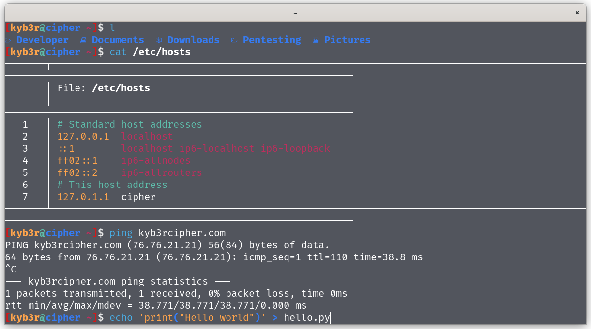

# kyb3r dotfiles

## My setup
- os: `Linux` 
- os: `Linux` 
- de: `GNOME` 
- terminal: `kitty`
- shell: `zsh`
- editor: `nvim`

## Installation
Clone this repository then install with stow:
```bash
git clone https://github.com/kyb3rcipher/dotfiles.git ~/.dotfiles 
cd ~/.dotfiles 
stow *
```
Or clone and install manually.<br>
**For updates** just do pull or reinstall :smile:.

### Screenshots

