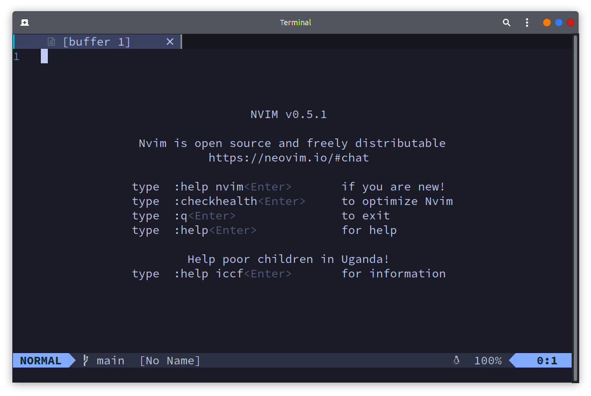
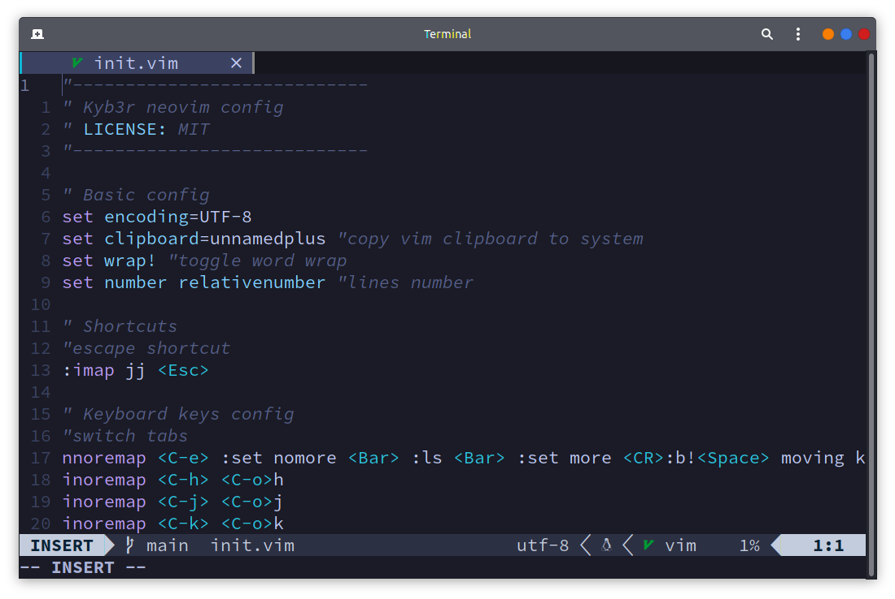

# neovim config

## Installation
Install this config with my dotfiles [install instuctions](../../../README.md#Installation). Then execute:
```bash
sh -c 'curl -fLo "${XDG_DATA_HOME:-$HOME/.local/share}"/nvim/site/autoload/plug.vim --create-dirs \
       https://raw.githubusercontent.com/junegunn/vim-plug/master/plug.vim'
nvim +PlugInstall
```
##### For manual installation
First put this folder to you local neovim config folder. Later install [vim-plug](https://github.com/junegunn/vim-plug#Installation) and execute: `nvim +PlugInstall`.

And everything will be ready :smile:

### Screenshots


